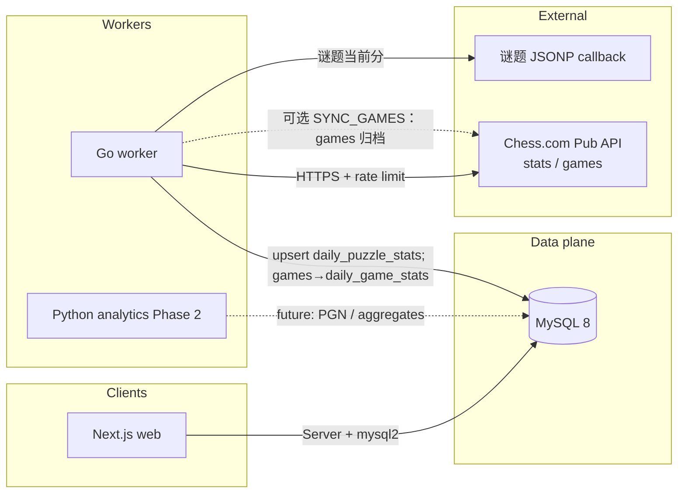

# Chess Tracker — 技术设计

## 1. 目标与范围

面向学生的 **Chess.com** 数据追踪与排行。

- **阶段一**：Rapid / Blitz / Bullet 棋钟分、谜题当前分（`chess_puzzle_current`）、每日快照、多时限排行榜、按周期的分数涨跌展示。
- **阶段二**：PGN 解析、开局胜率、AI 建议等（由 `analytics-py` 与扩展数据管道承担；`games` 表已预留）。

## 2. 系统架构

- **Web**：读取 `profiles`、`daily_game_stats` / `daily_puzzle_stats` 与视图 `v_leaderboard_*`；服务端通过 `DATABASE_URL` 直连 MySQL（`mysql2`）。排行榜支持 Rapid / Blitz / Bullet / 谜题四种时限，查询参数 `period` 控制涨跌统计窗口（7 / 30 / 90 日）。
- **Go Worker**：进程启动时拉取谜题当前分并写入 `daily_puzzle_stats`（当日 `rating_day_end`，`rating_day_start` 为前一日结束分或首次等于当日分）。棋钟分项由 `games` 全量重建 `daily_game_stats`：自该棋钟最早对局日起每个 UTC 日一行，有对局时 `rating` 为当日最后一盘 `player_rating`，无对局时沿用上一日 `rating`、盘数为 0。**对局归档**（`games` API，见 §5.1）在 `SYNC_GAMES=1` 时写入 `games` 并触发日表重算。
- **Python**：占位包；未来可消费 `games` 中的 PGN 或事件流，写回分析表。

## 3. 技术栈

| 层级 | 选型 |
|------|------|
| 前端 | Next.js App Router、TypeScript、Tailwind CSS、Radix Slot / 自研 Shadcn 风格组件 |
| 数据 | MySQL 8（`mysql/migrations`）；无 Postgres RLS，靠账号权限与应用逻辑 |
| 抓取服务 | Go，`database/sql` + `go-sql-driver/mysql`，`golang.org/x/time/rate` 全局限流 |
| 分析（Phase 2） | Python 3.11+（占位） |
| 本地依赖可选 | `docker-compose.yml`：MySQL 8 + Worker + Next（`docker compose up -d --build`） |

依赖版本与路由级清单见文末 **附录 A（自动快照）**；维护时请运行 `node scripts/update-tech-design.mjs` 刷新。

## 4. 数据模型（摘要）

表与视图定义在 `mysql/migrations/`（历史 `supabase/migrations` 仅作 Postgres 参考，新环境勿用）。

- **`profiles`**：`chess_username` 唯一，展示名、头像 URL。
- **`daily_game_stats`**：按 UTC `stat_date` 与 `time_class`（rapid/blitz/bullet）每人一行；自该棋钟最早对局日至当日连续覆盖。`rating` 为有对局时当日最后一盘 `player_rating`，无对局时为上一日 `rating`；无对局日胜负统计为 0。
- **`daily_puzzle_stats`**：按 UTC `stat_date` 每人一行；谜题当前分日终写入 `rating_day_end`。
- **`games`**：对局归档（Chess.com 月度 `games` JSON）。主键 `(profile_id, chesscom_uuid)`；含 `game_url`、`pgn`、`time_control`、`end_time`、`rated`、`time_class`、`rules`、双方 `username`/`rating`/`result`、追踪学生侧 `player_color`/`player_rating`/`player_result`、`accuracy_*`、`tcn`、`fen`、`initial_setup`、`eco_url`、`fetched_at`。
- **`v_leaderboard_rapid` / `v_leaderboard_blitz` / `v_leaderboard_bullet` / `v_leaderboard_puzzle`**：每人最新一日对应分项分（棋钟为 `rating`，谜题为 `rating_day_end`）及相对上一日的差（`*_delta`）。

完整对象列表以附录 A 为准。

## 5. Go Worker 行为

### 5.1 Chess.com Pub API：`stats` 与 `games`

基址均为 `https://api.chess.com/pub/player/{username}/`（`username` 小写，与官方说明一致）。

| 用途 | 方法 | 路径 | 说明 |
|------|------|------|------|
| 棋钟当前分（Pub API） | GET | `stats` | 返回各分项 `last.rating`；当前 Worker 不写入 DB，棋钟榜来自 `games`→`daily_game_stats`。 |
| 可用归档月份列表 | GET | `games/archives` | 返回该账号可用的 `{year, month}` 列表，用于决定要拉哪些月份。 |
| 单月已结束对局（JSON） | GET | `games/{YYYY}/{MM}` | 该月 **Live + Daily Chess** 已结束对局列表；每条含对局链接、时间控制、`end_time`、双方玩家与**赛后**棋钟 rating 等元数据（具体字段以官方 JSON-LD 为准）。 |
| 单月 PGN 打包 | GET | `games/{YYYY}/{MM}/pgn` | 标准多局 PGN 文本，适合批量入库 `games.pgn`。 |

**初始化「近 90 天」对局数据（Go Worker，可选）**：设置 `SYNC_GAMES=1` 与 `GAMES_BACKFILL_ON_START=1`（可选 `GAMES_BACKFILL_DAYS`，默认 90）。启动时先请求 `games/archives`，选取与「当前 UTC 日期 − N 日」有交集的月份，再逐月 `GET` 月度 JSON，以棋局 `uuid`（或 URL）为 `game_id` 幂等写入 `games`；对局 `end_time` 早于窗口边界的条目在写入前跳过。

**日常增量（Go Worker，可选）**：`SYNC_GAMES=1` 且非仅单次运行时，独立 goroutine 按 `GAMES_SYNC_INTERVAL`（默认 `10m`）拉取与「当前 UTC − `GAMES_INCREMENTAL_DAYS`（默认 2）」有交集的月度归档，仅 upsert 该时间窗口内（按棋局 `end_time`）的对局，然后全量重算 `daily_game_stats`。与 `stats`/谜题共用同一 Pub API 限流器（约 **2 QPS**）。

**与阶段一排行榜的关系**：棋钟榜「近 7/30/90 日」涨跌基于 `daily_game_stats` 的日级 `rating` 序列；需已同步 `games` 才能回溯。谜题榜基于 `daily_puzzle_stats`。

### 5.2 当前实现（谜题 + 可选 `games`→日表）

- **启动**：对所有 `profiles` 请求谜题当前分并 upsert `daily_puzzle_stats`（HTTP 超时见 `PUZZLE_HTTP_TIMEOUT`）。若 `SYNC_GAMES=1` 且 `GAMES_BACKFILL_ON_START=1`，则回溯对局并刷新 `daily_game_stats`。
- **常驻循环**：`PUZZLE_SYNC_INTERVAL`（默认 `10m`）轮询谜题；若 `SYNC_GAMES=1`，另有一循环按 `GAMES_SYNC_INTERVAL`（默认 `10m`）增量拉取近 `GAMES_INCREMENTAL_DAYS` 天对局并重算棋钟日表。`POLL_INTERVAL` 在配置中仍可读，当前主流程未用于棋钟 Pub `stats`。
- **配置**：`DATABASE_URL` 必填；`DATABASE_URL_FALLBACK`、`DATABASE_PREFER_IPV4`、`DATABASE_IPV6_ONLY`、`WORKER_CONCURRENCY`、`RUN_ONCE`、`PUZZLE_HTTP_TIMEOUT` 等见附录 A。
- **限流**：Chess.com Pub API 侧全局限流约 **2 QPS**。
- **重试**：HTTP **429** 结合 `Retry-After` 与退避（实现见 `backend-go/internal/chesscom`）。
- **并发**：多个 worker goroutine 从 channel 取 `profile`，共享限流器。

## 6. 前端要点

- **`/`**：入口，链向排行榜与添加学生。
- **`/leaderboard`**：默认 Rapid；`/leaderboard/blitz`、`/bullet`、`/puzzle` 切换时限。`?period=7|30|90` 控制「近 N 日涨跌」窗口（默认 7）。兼容旧参数 `?tc=` → 301 到对应路径。
- **排行榜表格**：展示当前分、周期涨跌（基于 `daily_game_stats` / `daily_puzzle_stats` 在服务端聚合）、行内修改展示名、删除学生（需确认密码）。谜题榜列显示「谜题当前分」。
- **`/players/new`**：**Server Action** 写入 `profiles`；提交前 `GET /pub/player/{username}` 校验并抓取头像与展示名。
- **`POST /api/dev/add-player`**：仅 `NODE_ENV=development`，便于调试（见 `AGENTS.md`）。
- **`GET /api/health`**：健康检查。
- **环境变量**：`DATABASE_URL` 仅服务端；可选 `STUDENT_DELETE_PASSWORD`（未设置时删除确认密码有内置默认值，生产务必覆盖）。详见 `.env.example`。

## 7. 安全与合规

- 仓库内仅保留 `.env.example`；真实配置在 `web/.env.local`、`backend-go/.env` 或托管平台密钥管理。
- 访问控制：MySQL 账号权限 + 应用层逻辑；勿将可写连接串暴露给浏览器。
- Chess.com：使用官方 Pub API 与公开谜题端点，遵守速率限制与条款。

## 8. 部署建议（简）

| 组件 | 建议 |
|------|------|
| `web/` | Vercel 等；配置生产环境 `DATABASE_URL` |
| Worker | Railway / Render / Fly 等常驻进程；`DATABASE_URL` 与调优环境变量 |
| 数据库 | 托管 MySQL；执行 `mysql/migrations/*.sql` 或由 CI / 本地 Docker MySQL 初始化 |

## 9. 演进路线

- **家长视图**：自建或第三方 Auth，关联 `profile_id`，只读 DB 账号。
- **Realtime**：订阅 binlog / 轮询 API，排行榜无刷新更新。
- **PGN / 对局管道**：使用 `games/archives` + `games/{YYYY}/{MM}`（或 `/pgn`）做首次回溯与日常增量（见 §5.1），Worker 或任务队列写入 `games`；Python 异步解析并回写统计表。

## 10. 文档与代码同步

- **附录 A** 由 `scripts/update-tech-design.mjs` 根据当前仓库生成（依赖版本、页面/API 路由、Smoke 路径、`001_init.sql` 中的表/视图、Worker 环境变量键）。
- **建议在以下情况后重新运行该脚本**：新增/调整 App 路由或 Route Handler、修改 `mysql/migrations` 初始化结构、增减 Worker 配置项、或 Smoke 探测路径。
- 可将该脚本接入 CI（例如 PR 中检查附录是否过期：对比生成结果与提交内容），或作为发布前 checklist 手动执行。

---

## 附录 A：代码库自动快照

<!-- TECH_DESIGN_AUTO_START -->

> **自动快照**（UTC `2026-04-10T03:50:10.244Z`）：由 `scripts/update-tech-design.mjs` 生成。变更页面、API、`001_init.sql` / `005_split_daily_stats.sql` 或 Worker 配置后请重新运行该脚本。

### 前端依赖（`web/package.json` 摘录）

| 包 | 版本 |
|------|------|
| `next` | ^15.2.4 |
| `react` | ^19.0.0 |
| `react-dom` | ^19.0.0 |
| `mysql2` | ^3.14.0 |

### Next.js 页面路由（`web/app/**/page.tsx`）

| 路径 | 源文件 |
|------|--------|
| `/` | `page.tsx` |
| `/leaderboard` | `leaderboard/[[...slug]]/page.tsx` |
| `/leaderboard/blitz` | `leaderboard/[[...slug]]/page.tsx` |
| `/leaderboard/bullet` | `leaderboard/[[...slug]]/page.tsx` |
| `/leaderboard/puzzle` | `leaderboard/[[...slug]]/page.tsx` |
| `/players/new` | `players/new/page.tsx` |

### HTTP API（`web/app/**/route.ts`）

| 路径 | 源文件 |
|------|--------|
| `/api/dev/add-player` | `api/dev/add-player/route.ts` |
| `/api/health` | `api/health/route.ts` |

### Smoke 探测路径（`web/scripts/smoke.cjs`）

`/`、`/api/health`、`/leaderboard`、`/leaderboard/puzzle`、`/players/new`

### MySQL 对象（`001_init.sql` + `005_split_daily_stats.sql` 合并）

- **表**：`daily_game_stats`、`daily_puzzle_stats`、`games`、`profiles`
- **视图**：`v_leaderboard_blitz`、`v_leaderboard_bullet`、`v_leaderboard_puzzle`、`v_leaderboard_rapid`

### Worker 环境变量（`backend-go/internal/config/config.go`）

| 变量 | 说明 |
|------|------|
| `DAILY_GAME_STATS_LOOKBACK_DAYS` | 已解析；当前重算 `daily_game_stats` 为自最早对局日至 UTC 当日的全量行，该值暂未使用，默认 `120` |
| `DATABASE_IPV6_ONLY` | 设为 `1`/`true` 时仅 IPv6 |
| `DATABASE_PREFER_IPV4` | 设为 `1`/`true` 时优先 IPv4 拨号 |
| `DATABASE_URL` | MySQL DSN，必填 |
| `DATABASE_URL_FALLBACK` | 可选备用 DSN |
| `GAMES_BACKFILL_DAYS` | 开局回溯对局的天数，默认 `90` |
| `GAMES_BACKFILL_ON_START` | 设为 `1` 时进程启动时回溯对局 |
| `GAMES_INCREMENTAL_DAYS` | 定时增量只处理与「当前 UTC − N 日」相交的月度归档，且只 upsert `end_time` 不早于该窗口的对局；默认 `2` |
| `GAMES_SYNC_INTERVAL` | 对局增量同步周期，默认 `10m` |
| `POLL_INTERVAL` | 已解析，当前 Worker 未用于棋钟轮询；棋钟分由 `games`→`daily_game_stats` 聚合，默认 `1h` |
| `PUZZLE_HTTP_TIMEOUT` | 谜题 HTTP 单次超时，默认 `12s` |
| `PUZZLE_SYNC_INTERVAL` | 谜题当前分轮询周期，默认 `10m` |
| `RUN_ONCE` | 设为 `1`/`true` 时完整同步一次后退出 |
| `SYNC_GAMES` | 设为 `1`/`true` 时同步 Chess.com 对局到 `games` 表 |
| `WORKER_CONCURRENCY` | 并发 worker 数，默认 `2` |

<!-- TECH_DESIGN_AUTO_END -->

*人工撰写章节与 `AGENTS.md` 中的命令、环境说明应与本设计一致；冲突时以代码与迁移为准并更新本文。*
